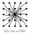

Rotationally equivariant graph neural networks for integrated circuits

This file contains some rough notes on how you might apply rotational equivariance to a graph neural network describing an integrated circuit.

## Why bother?

Many systems are rotationally inviariant.  Exploiting this symmetry can improve model performace and robustness.  Using a neural network model which exploits this symmetry guarantees that the model behaves the same way regardless of the orientation of the input data.  It also typically improves performance of the model.  Here's an example of the benefits of equivarience when applied to CNNs:

### Example 1
The output of a conventional CNN is not rotationally invariant

### Example 2
Output of an equivariant CNN

*(Credit: Maurice Weiler, Gabriele Cesa)*

Integrated circuits are symmetric with respect to 90 degree rotations.
This document explains how to exploit that symmetry.

## GNN notation

General form of the update rule that most GNNs use to update their node attributes:

$h^\prime_i\ =\ \gamma\left(h_i \ , \ \bigoplus\limits_{j\in \mathcal{N}(i)}\ \phi(h_i,\ h_j,\ e_{ij}) \right)$

Where:
 - $h_i$  are node attributes.  (for circuit components and points of interest along the circuit)

 - $e_{ij}$  are edge attributes between nodes $i$ and $j$.  ($e_{ij}$ might encode a neighboring node's physical proximity and/or whether it is directly connected by a copper interconnect.)

 - $\bigoplus$  is a message aggregator *(typically a sum, $\sum_{j\in \mathcal{N}(i)}$)*

 - $\phi()$  calculates the message from node j to node i.  *(Typically an MLP.)*

 - $\gamma()$  is the node update function, combining the aggregated messages with the attributes for node $i$.  *(Typically an MLP.)*

## Introducing geometry
In general, the 3D coordinates of each node ($\vec{x}_i, \vec{x}_j$) could affect each node and it's communication with it's neighbors.  Let's make this dependence explicit:

$h^\prime_i\ =\ \gamma\left(h_i \ , \ \bigoplus\limits_{j\in \mathcal{N}(i)}\ \phi(h_i,\ h_j,\ e_{ij},\ \vec{x}_i,\ \vec{x}_j) \right)$

## Translational symmetry

Suppose only the relative position of nodes matters.  This reduces the complexity of the model because it reduces the number of arguments we need to pass to the message function:

$h^\prime_i\ =\ \gamma\left(h_i \ , \ \bigoplus\limits_{j\in \mathcal{N}(i)} \phi(h_i,\ h_j,\ e_{ij},\  \vec{x}_i-\vec{x}_j) \right)$

To simplify the notation, let's assume that the message between nodes $i$ and $j$ only depends on their relative position.  I will borrow the notation used in Convolutional Neural Networks.

$h^\prime_i\ =\ \gamma\left(\sum\limits_{j\in \mathcal{N}(i)} k(\vec{x}_j-\vec{x}_i)\ h_j \right)$

Where
- $\mathcal{N}(i)$ denotes all nearby pixel locations (including the original pixel i).
- $k(\vec{x}_j-\vec{x}_i)$ is a function which only depends on the relative position of nodes i and j.  *(Also called a "convolution kernel".  This is a generalization of CNNs, which correspond to graphs with regularly spaced nodes connected to a window of nearby nodes)*

NOTE: This equation above no longer describes a general graph neural network.
But the simplification makes it easier to impose rotational equivariance.
*(More general graph neural networks are discussed at the end of this document.)*

## Rotational Symmetry

Integrated circuits differ from point clouds or molecular graphs
because they have discrete 90-degree rotational symmetry in the XY plane.
Equivariance GNNs allows us to exploint this rotational symmetry to improve prediction accuracy
and gaurantee that the the model behaves consistently when the graph coordinates are rotated by $\pm$90 or 180 degrees.

## Data augmentation

We want to guarantee that our predictions are consistent at different orientations
($\{0, \frac{\pi}{2}, \pi, \frac{3}{2}\pi\}$).

*One way* to do this is to use data augmentation, ie. to train the GNN using different versions of each training data, rotated in all 4 directions.  

### Lifting operation

Alternatively, we can *think* of data augmentation as training with the original *(non-augmented)* data on a "lifted" version of the graph.  Introducing this concept now will make it easier later when we discuss equivariance.

A "lifted" graph contains 4 indentical copies of the original graph *(rotated by different $\{0, \frac{\pi}{2}, \pi, \frac{3}{2}\pi\}$, respectively)*, that share the same model parameters *(ie. the $k()$ function)*.

*...becomes*

*(I will add the edges later...)*

Each node in the lifted graph, $\nu$ (dark dots in the figure) corresponds to a rotated version of the original graph.

Define:
- $\theta_\nu$  is the orientation corresponding to node $\nu$ *(where $\theta_\nu \in \{0, \frac{pi}{2}, \pi, \frac{3}{2}\pi\}$)*.
- $\mathsf{h}_{\nu}$ = The attributes of node $\nu$ if the physical location of all the nodes in the graph had been initially been rotated by $\theta_\nu$.

Data augmentation is equivalent to updating each rotated version of the graph ($\theta$) independently.  During training, each training example is rotated and loaded into the corresponding version of the graph.  That way, all orientations of the input graph are considered.

Different orientations of the graph do not talk to each other during inference.  But they all share the same $k()$ function.

## Equivariant GNNs with $C_4$ symmetry

When discussing data augmentation, we considered a "lifted" graph ($\nu$ and $\mu$).  During the update process, nodes $\nu$ and $\mu$ only interact if they correspond to the same orientation ($\theta$).

*More generally*, we can allow the nodes from different orientations to talk to each other during the update process.

To do that, we must define a more general message passing function (convolution kernel).

### Definition $\mathsf{k}(\vec{x},\theta)$ 

$\mathsf{k}(\vec{x},\theta)$ is a convolution kernel which is defined over the space of translations ($\vec{x}$) *and* rotations ($\theta$).

However to satisfy *rotational equivariance*, this new kernel must obey *rotational* and *translational* symmetry.  That means, it must only depend on the difference between the node positions and the two angles $(\theta_\nu-\theta_\mu)$.  *(See below.)*

### Update rule for node $\nu$

$\mathsf{h}^\prime_\nu\ =\ \gamma\left(\sum\limits_{\mu\in\mathcal{N}(\nu)} \mathsf{k}(R_{\theta_\nu}(\vec{x}_{j(\mu)}-\vec{x}_{i(\nu)}),\ \theta_\mu-\theta_\nu) \ \mathsf{h}_\mu \right)$

Where
- $R_{\theta_\nu}$ is the rotation matrix corresponding to angle $\theta_\nu$
- $i(\nu)$ is the index of node $i$ from the original graph corresponding to node $\nu$ in the "lifted" graph.
  
Note: We rotated the coordinates ($\vec{x}_j(\mu)-\vec{x}_i(\nu)$) by the angle ($\theta_\nu$) because this equation is the update rule for node $\nu$.

### Pooling over orientations
At the end of the computation, we can combine the embeddings we get at every orientation to get an orientation-independent version.  At the node level, it might look like this:

$h_i^{(final)}\ =\sum\limits_{\theta\in\{0, \frac{pi}{2}, \pi, \frac{3}{2}\pi\}} \mathsf{h}_{\nu(i,\theta)}$

Where:
- $\nu(i,\theta)$ is the index of node $\nu$ (from the "lifted" graph) corresponding to node $i$ (from the original graph) initially rotated by $\theta$.

### Model complexity
Model complexity is 4x as large the same as the original, non-equivariant GNN because the new message function $\mathsf{k}(\vec{x},\theta)$ depends explicitly on $\theta$, which can have 4 values.

In spite of this, the method has been reported to perform better than a regular GNN model *(with the same number of parameters)* using traditional data-augmentation.

## General equivariant GNNs with $C_4$ symmetry

The update function above ignores edge attributes and assumes that nodes are updated using a simple linear convolution kernel, $k()$.

As promised, here's a more general version of the equivariant GNN node update function:

$\mathsf{h}^\prime_\nu\ =\ \gamma\left(\mathsf{h}_\nu\ ,\ \bigoplus\limits_{\mu\in\mathcal{N}(\nu)}  \ \phi\left(h_{\nu(i)},\ h_{\mu(j)},\ e_{i(\nu),j(\mu)},\ R_{\theta_\nu}(\vec{x}_{j(\mu)}-\vec{x}_{i(\nu)}),\ \theta_\mu-\theta_\nu\right) \right)$

*(I have assumed that the edge attributes $e_{i,j}$ are independent of position of the nodes and are rotationally invariant.)*

## *Further reading*

These notes were inspired by Erik Bekker's videos on Equivariant CNNs:

- lecture 1.1  https://www.youtube.com/watch?v=z2OEyUgSH2c&list=PL8FnQMH2k7jzPrxqdYufoiYVHim8PyZWd&index=1
- lecture 1.2  https://www.youtube.com/watch?v=F0OxOCZwm1Q&list=PL8FnQMH2k7jzPrxqdYufoiYVHim8PyZWd&index=2
- lecture 1.3  https://www.youtube.com/watch?v=cWG_1IzI0uI&list=PL8FnQMH2k7jzPrxqdYufoiYVHim8PyZWd&index=3
- lecture 1.4  https://www.youtube.com/watch?v=X3gP1voalDE&list=PL8FnQMH2k7jzPrxqdYufoiYVHim8PyZWd&index=4
- lecture 1.5  https://www.youtube.com/watch?v=kTvow5-eCCQ&list=PL8FnQMH2k7jzPrxqdYufoiYVHim8PyZWd&index=5
- lecture 1.6  https://www.youtube.com/watch?v=mntjPJYxwTI&list=PL8FnQMH2k7jzPrxqdYufoiYVHim8PyZWd&index=6
- lecture 1.7  https://www.youtube.com/watch?v=erlCaoj6sTg&list=PL8FnQMH2k7jzPrxqdYufoiYVHim8PyZWd&index=7

After watching those you can skip to the video on equivariant graph neural networks:
- lecture 3.2  https://www.youtube.com/watch?v=o-KcYASwUco&list=PL8FnQMH2k7jzPrxqdYufoiYVHim8PyZWd&index=17

*(You can skip the videos on steerable neural networks (2.1-2.7) because they are only relevant for systems
with continuous rotational symmetry.)*

